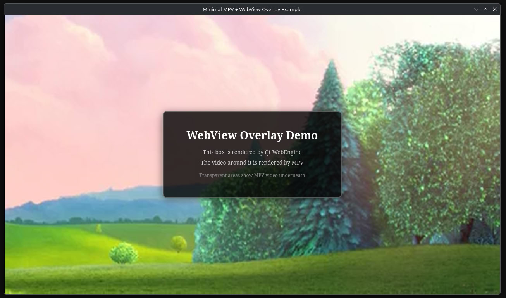
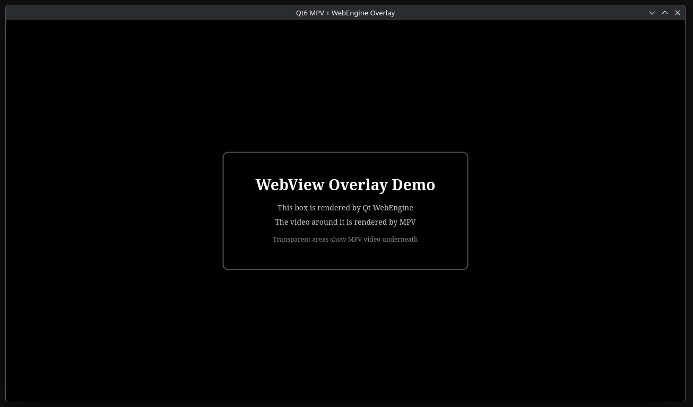
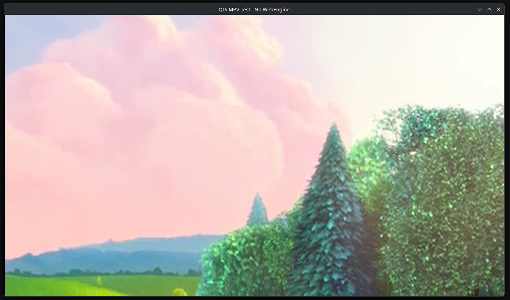

# MPV + WebEngine Overlay for Qt

Demonstrates transparent Qt WebEngine overlays on MPV video rendering.

- Qt5 works perfectly.
- Qt6 has a regression where WebEngine clears/occludes MPV rendering. See [QTBUG-111739](https://bugreports.qt.io/browse/QTBUG-111739).

## Examples

| Example                             | Description                         |
|-------------------------------------|-------------------------------------|
| `example_qt5`                       | Qt5 reference implementation        |
| `example_qt6_minimal_migration`     | Minimal Qt5→Qt6 port (same pattern) |
| `example_qt6_artifacts`             | Qt6 with visual distortion artifacts|
| `example_qt6_mpv_only`              | Qt6 with MPV only (no WebEngine)    |
| `example_qt6_with_webengine_broken` | Qt6 with WebEngine overlay          |

## Screenshots

### Qt5 MPV + WebEngine - Working

MPV video renders in background with transparent WebEngine overlay on top.

### Qt6 MPV + WebEngine - Broken

Video disappears (black) when WebEngine overlay is added. Only overlay visible.

### Qt6 MPV - Working

Qt6 MPV rendering works, albeit without the components rendered by WebEngine.

## Requirements

- **Qt5:** Qt5 (Core, Qml, Quick, WebEngine), libmpv, OpenGL
- **Qt6:** Qt6 (Core, Qml, Quick, WebEngineQuick), libmpv, OpenGL

## Download Test Video
Or use any local MP4 file.

```bash
curl -L -o BigBuckBunny_512kb.mp4 https://archive.org/download/BigBuckBunny_328/BigBuckBunny_512kb.mp4
```

## Build & Run

```bash
# Qt5
cd example_qt5 && mkdir build && cd build
cmake .. && make
./minimal-overlay ../../BigBuckBunny_512kb.mp4

# Qt6
cd example_qt6_minimal_migration && mkdir build && cd build
cmake .. && make
./minimal-overlay ../../BigBuckBunny_512kb.mp4
```
